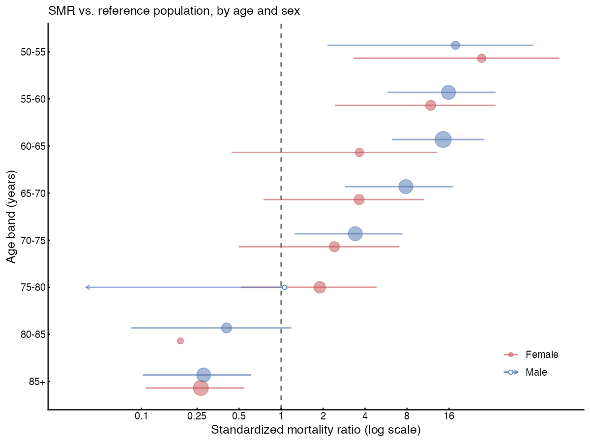

AI transparency: This README, the repository text, and the code was generated by Claude Science (Anthropic, Opus 4.8).

[](https://github.com/bnwolford/smr-norway/actions/workflows/test.yml)

**Standardized mortality ratio (SMR) against the Norwegian general population.**

An R toolkit that compares the mortality of a study cohort with that expected
from the general Norwegian population, using official age-, sex- and
calendar-year-specific life-table rates from Statistics Norway (SSB). It
computes the standardized mortality ratio (SMR = observed / expected deaths)
overall and by sex and age band, with exact Poisson (Garwood) 95% confidence
intervals and two-sided p-values, and produces publication-quality forest
plots.

The person-time engine uses an **exact Lexis expansion**: each participant's
follow-up is split at every birthday and every 1 January boundary, so that each
segment falls in a single age × sex × calendar-year cell and is matched to the
correct population rate. This handles delayed entry (left truncation),
right-censoring, participants ageing across bands, and secular change in
population mortality.



---

## Contents

```
smr-norway/
├── README.md                     <- you are here
├── LICENSE                       <- MIT
├── CITATION.cff                  <- how to cite this toolkit
├── renv.lock  / DESCRIPTION      <- dependency pinning
├── run_example.R                 <- end-to-end demo on synthetic data
│
├── .github/workflows/
│   └── test.yml                  <- CI: installs R + deps, runs tests on every push
│
├── scripts/                      <- the analysis scripts (pick ONE to match your data)
│   ├── smr_analysis.R                        <- input: date of birth + entry/exit + event
│   ├── smr_analysis_age_input.R              <- input: age at entry (no DOB)
│   ├── smr_analysis_dates.R                  <- input: THREE dates (start/end obs + death) *most common*
│   ├── smr_analysis_dates_80plus_2013_2022.R <- worked restriction: age 80+, years 2013-2022
│   ├── smr_plot.R                <- base-R two-panel forest + obs/expected bars
│   └── smr_plot_gg.R             <- ggplot2 forest plot (CI-visible, alpha points)
│   └── utils/
│       ├── reconcile_deaths.R    <- audit: raw death dates -> counted deaths, stage by stage
│       └── find_lost_deaths.R    <- audit: list any deaths dropped during Lexis expansion
│
│
├── data/
│   └── norway_reference_mortality_rates.csv  <- SSB reference rates (ships with repo)
│
├── data-raw/
│   └── fetch_ssb_rates.R         <- reproducibly re-download the reference rates from SSB
│
├── examples/
│   └── example_cohort_dates.csv  <- synthetic cohort for the demo
│
├── docs/
│   ├── methods.md                <- methods-section text for a manuscript
│   ├── data_dictionary.md        <- column definitions for inputs & outputs
│   └── figures/                  <- example figures
│
└── tests/
    └── test_smr.R                <- self-checks (person-time conservation, death counts)
```

---

## Quick start

### 1. Requirements

- **R ≥ 4.0**
- One package: **`data.table`**. Plotting additionally needs **`ggplot2`**
  (for `scripts/smr_plot_gg.R`) — the base-R plotter needs nothing extra.

```r
install.packages(c("data.table", "ggplot2"))
```

### 2. Run the built-in demo

From the repository root:

```r
source("run_example.R")
```

This runs `scripts/smr_analysis_dates.R` on `examples/example_cohort_dates.csv`,
prints the SMR tables, writes the output CSVs, and saves a forest plot to
`docs/figures/`.

### 3. Run on your own data

1. Put your cohort file somewhere and note its path.
2. Open the script that matches the data you have (see the decision guide below).
3. Edit **only the `USER SETTINGS` block** at the top — file paths, the
   column-name mappings (`COL_ID`, `COL_SEX`, `COL_ENTRY`, …), the sex coding
   (`SEX_MAP`), date formats, and any restrictions.
4. `source()` the script. It prints the SMR tables and writes CSVs to `OUT_DIR`.
5. Optionally `source()` a plotting function and pass it the `by_age` table.

```r
source("scripts/smr_analysis_dates.R")   # writes smr_overall.csv, smr_by_sex.csv, smr_by_age.csv
source("scripts/smr_plot_gg.R")
p <- plot_smr_gg("smr_by_age.csv")
ggplot2::ggsave("my_forest.png", p, width = 8, height = 6, dpi = 300)
```

---

## Which analysis script do I use?

| Your cohort file has… | Use |
|---|---|
| date of birth + entry date + exit date + event flag | `scripts/smr_analysis.R` |
| **age at entry** + entry date + exit date + event flag (no DOB) | `scripts/smr_analysis_age_input.R` |
| **three dates**: start of observation, end of observation, death date | `scripts/smr_analysis_dates.R` |
| any of the above, but you want to restrict age and/or calendar period | copy the closest script and set the restriction toggles (worked example: `scripts/smr_analysis_dates_80plus_2013_2022.R`) |

All variants run the **identical** Lexis/SMR engine; they differ only in how
entry/exit/event and date of birth are derived up front.

---

## Input data format

A single row per participant. Column *names* are configurable in each script's
`USER SETTINGS` block — you do **not** need to rename your columns, just point
the `COL_*` settings at them. Example for the three-date script:

| id | sex | start_obs | end_obs | death_date | age_entry |
|----|-----|-----------|---------|------------|-----------|
| 1  | M   | 2013-04-01 | 2022-12-31 |            | 71 |
| 2  | F   | 2014-06-15 | 2019-02-20 | 2019-02-20 | 68 |

- `death_date` is **blank/NA** for participants who did not die (or whose death
  is outside the observation window — see below).
- Dates may be in any of several formats (`DATE_FORMATS` setting); ISO
  `YYYY-MM-DD` is safest.
- Sex may be coded any way you like — map it in `SEX_MAP`.

See `docs/data_dictionary.md` for every input and output column.

---

## How exit and event are derived (three-date script)

```
died      = 1  if a death date exists AND death_date <= end_obs, else 0 (censored)
exit_date = min(death_date, end_obs)
```

A death recorded **after** the observation close is treated as censoring at the
close date, not as an observed death. This is deliberate — the person was no
longer under observation.

---

## Two modelling choices you should know about

These are the two places where the toolkit makes a defensible-but-not-unique
decision. Both are documented, both are toggles, and both should be reported in
your methods.

### 1. Date of birth from age at entry (`AGE_OFFSET`)

When you supply age at entry instead of a true DOB, birth date is reconstructed
as `entry_date − (age_entry + AGE_OFFSET) years`. `AGE_OFFSET = 0.5` (default)
places the birthday mid-year, which centres the age-misplacement error for
*completed*-years ages. Set `AGE_OFFSET = 0` if your ages are exact. In testing,
this choice moved the overall SMR by ~3% versus using exact DOB.

### 2. Same-day follow-up (`SAMEDAY`)

A participant whose observation entry and exit fall on the **same day** (e.g. a
death dated the day observation starts) contributes zero-length follow-up. The
Lexis split cannot place such a record, so both the person-time *and the death*
would silently disappear. The `SAMEDAY` setting controls this:

- `SAMEDAY = "keep"` **(default)** — credit 1 day of follow-up so the death is
  counted. Recommended for an SMR: never silently drop a known death. The added
  person-time (~1 day per affected row) is negligible for expected deaths.
- `SAMEDAY = "exclude"` — drop these rows entirely. Use only if same-day dates
  reflect a data artifact or a landmark-survival entry rule, and report the
  exclusion.

The script prints how many rows were affected.

---

## Auditing observed deaths

If the observed count in the output does not match your raw count of death
dates, the two utility scripts explain the difference exactly:

- **`scripts/utils/reconcile_deaths.R`** — tallies deaths at each stage: death
  dates present → deaths after obs close (censored by design) → surviving row
  cleaning + calendar clamp → landing in the final Lexis table.
- **`scripts/utils/find_lost_deaths.R`** — lists the IDs of any deaths that were
  flagged but never reached the Lexis table, with the reason (zero-length
  follow-up, or age-floor exclusion in a restricted analysis).

Source either one **after** sourcing an analysis script (they use objects left
in memory).

---

## Restricting age and/or calendar period

`scripts/smr_analysis_dates_80plus_2013_2022.R` is a worked example restricting
to **attained age ≥ 80** and **calendar years 2013–2022**. The two restrictions
use different mechanisms, and this matters:

- **Calendar period** → `STUDY_START` / `STUDY_END`. Clamps each person's
  follow-up to the window and converts deaths after the window to censoring.
- **Attained age** → a filter on the Lexis table *after* expansion
  (`lex <- lex[age >= AGE_MIN]`). This keeps only the in-range *slices* of each
  person's follow-up. Filtering the input rows instead would wrongly retain
  out-of-range person-time.

Note `age >= 80` means attained age 80 **and older** (`[80,81)` and up). For
strictly over 80, set `AGE_MIN <- 81`.

---

## Output files

Each analysis script writes to `OUT_DIR`:

| File | Contents |
|------|----------|
| `smr_overall.csv` | overall observed, expected, person-years, SMR, 95% CI, p-value |
| `smr_by_sex.csv`  | the same, by sex |
| `smr_by_age.csv`  | the same, by sex × 5-year age band (input to the plots) |
| `smr_person_time_cells.csv` | the full Lexis table (one row per age×sex×year cell) |
| `smr_excluded_rows.csv` | any rows dropped for bad/missing values (if any) |

---

## Reference mortality rates

`data/norway_reference_mortality_rates.csv` ships with the repo and contains
sex × single-year-of-age × calendar-year mortality rates for Norway derived
from **Statistics Norway StatBank table 07902** (official life tables). Columns:
`sex`, `age` (0–106), `year`, `qx` (probability of death), `mx` (central rate,
used for expected deaths), `qx_per_1000`.

`mx` is derived from the published probability of death as
`mx = qx / (1 − qx/2)` (uniform-deaths-within-year assumption).

To re-download or extend the rate table (e.g. earlier years, more recent
updates), run `data-raw/fetch_ssb_rates.R` — it queries the SSB JSON-stat API
and rebuilds the CSV. **Re-running it requires network access to `data.ssb.no`.**

---

## Reproducibility

- **Deterministic.** No random components; given the same inputs the outputs are
  bit-identical.
- **Minimal dependencies.** Base R + `data.table` for analysis; `ggplot2`
  optional for one plotter. Pinned in `DESCRIPTION` / `renv.lock`.
- **Self-contained.** The reference rate table is committed, so an analysis runs
  offline. The fetch script is provided for provenance and updates.
- **Tested.** `tests/test_smr.R` checks person-time conservation (naive
  follow-up == sum of Lexis segments) and that every in-window death is counted
  exactly once.

Run the tests with:

```r
source("tests/test_smr.R")
```

---

## Citing

If you use this toolkit, please cite it (see `CITATION.cff`) **and** the
underlying data source:

> Statistics Norway (Statistisk sentralbyrå). StatBank table 07902: Life
> tables, by sex and age. https://www.ssb.no/en/statbank/table/07902

A ready-to-adapt methods paragraph is in `docs/methods.md`.

---

## License

MIT — see `LICENSE`. Note this covers the *code*; the reference mortality rates
are from Statistics Norway and are subject to
[SSB's terms of use](https://www.ssb.no/en/informasjon/copyright)
(generally CC BY 4.0 for open data — verify for your use).
